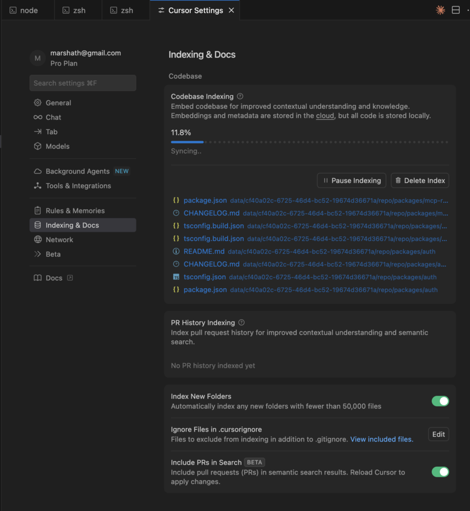

# Cursor IDE Workflow Guide

This guide covers advanced techniques for benchmarking Cursor's performance on library-specific tasks using StackBench.

## Overview

Cursor IDE integration with StackBench follows a **human-in-the-loop** approach where you manually interact with Cursor's AI assistant to implement use cases. This evaluates how effectively Cursor helps developers through chat interfaces and code suggestions.

## Workflow Summary

```
stackbench setup → manual IDE execution → stackbench analyze
```

**Key phases:**
1. **Setup** - Automated repository preparation and use case generation
2. **Execution** - Manual interaction with Cursor IDE for each use case
3. **Analysis** - Automated evaluation of implementations

## Setting Up for Cursor Execution

### Initial Setup

```bash
# Standard setup with Cursor agent and language specification
stackbench setup https://github.com/user/awesome-lib -a cursor -l python

# Focus on specific documentation folders with JavaScript library
stackbench setup https://github.com/user/awesome-lib -a cursor -i docs,examples -l js

# Use specific branch with TypeScript library
stackbench setup https://github.com/user/awesome-lib -a cursor -b develop -l typescript
```

### Understanding the Generated Structure

After setup, you'll have:
```
./data/<uuid>/
├── repo/                    # Cloned repository for Cursor to explore
├── data/
│   ├── use_cases.json      # Generated use cases with requirements
│   └── use_case_1/         # Target directory for implementation
│       └── solution.py     # Where Cursor will create the implementation
├── run_context.json        # Benchmark run state
├── results.json            # Generated after analysis
└── results.md              # Generated after analysis
```

## Executing Use Cases in Cursor

### Step 1: Get the Use Case Prompt

```bash
# Print prompt for use case 1
stackbench print-prompt <run-id> -u 1

# Print and copy to clipboard (recommended)
stackbench print-prompt <run-id> -u 1 --copy

# Check what use cases are available
stackbench status <run-id>
```

**Example prompt structure:**
```
=== USE CASE 1: Basic Query Implementation ===

**Elevator Pitch:** This use case demonstrates basic query patterns...
**Target Audience:** Developers new to the library
**Complexity Level:** Beginner

**Functional Requirements:**
1. Import the main query module
2. Create a basic query with user input
3. Execute the query and return results

**User Stories:**
- As a developer, I want to create simple queries...

**Implementation Target:**
Please create your implementation at:
./data/<uuid>/data/use_case_1/solution.py
```

### Step 2: Open Cursor in StackBench Root

```bash
# Open Cursor at the StackBench root directory
cursor .
```

**Why this approach works:**
- Cursor can explore both the cloned repository and the target directories
- Access to real examples and documentation in `./data/<uuid>/repo/`
- Understanding of project structure and patterns
- Ability to create files in the correct target locations

### Step 3: Wait for Cursor Indexing to Complete

**⚠️ Critical Step:** Before implementing use cases, you must wait for Cursor to finish indexing the codebase.

**To check indexing status:**
1. Open Cursor Settings (Cmd/Ctrl + ,)
2. Navigate to **"Indexing & Docs"** 
3. Look at **"Codebase Indexing"** section
4. Wait until the progress shows **100%** and **"Syncing..."** disappears



**Why this matters:**
- Cursor needs to index all documentation and code files
- Without indexing, Cursor lacks context about the library's APIs and patterns
- Incomplete indexing leads to poor implementations that don't follow library conventions

**Typical indexing time:** 30 seconds to 2 minutes depending on repository size.

### Step 4: Start a New Chat Session

**Simple workflow:**

1. **Start a new chat session** for each use case
2. **Paste the complete prompt** from `print-prompt`
3. **Let Cursor work** - Allow it to explore and implement automatically
4. **Accept the implementation** - Let Cursor create the file as proposed

**Example conversation:**
```
You: [Paste the complete use case prompt]

Cursor: I'll help you implement this use case. Let me first explore 
the repository structure to understand the library's patterns...

[Cursor explores files and provides implementation]
[Cursor creates the file at the specified location]

You: ✓ Accept the implementation
```

**Key principle:** Let Cursor work autonomously to evaluate its true capabilities without human guidance.

### Step 4: Check the Implementation

**Important:** Cursor should automatically create the implementation file at the specified location:
```bash
./data/<uuid>/data/use_case_1/solution.py
```

**File naming convention:**
- Use case 1 → `use_case_1/solution.py`
- Use case 2 → `use_case_2/solution.py`  
- Use case N → `use_case_N/solution.py`

**Simple verification:**
- ✅ File was created at the correct path
- ✅ Implementation exists and looks complete

## Simple Workflow Checklist

For each use case:

- [ ] Get formatted prompt: `stackbench print-prompt <run-id> -u N --copy`
- [ ] Open Cursor at StackBench root: `cursor .`
- [ ] **Wait for Cursor indexing to complete** (check Settings → Indexing & Docs)
- [ ] Start new chat session
- [ ] Paste complete prompt
- [ ] Let Cursor explore and implement autonomously
- [ ] Accept Cursor's implementation
- [ ] Verify file created at: `./data/<uuid>/data/use_case_N/solution.py`
- [ ] Move to next use case

After all use cases:

- [ ] Run `stackbench analyze <run-id>`
- [ ] Review generated results

## Next Steps

- **[How StackBench Works](how-stackbench-works.md)** - Understanding what happens during analysis
- **[CLI Commands Reference](cli-commands.md)** - Complete command documentation
- **[Getting Started](getting-started.md)** - Return to basics if needed

